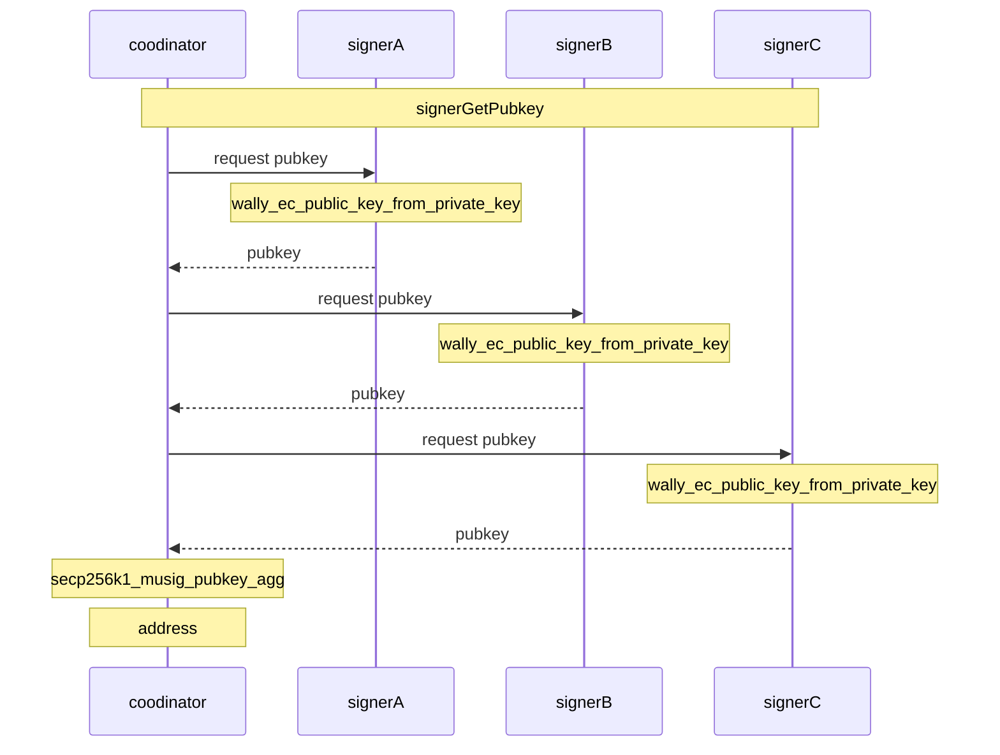
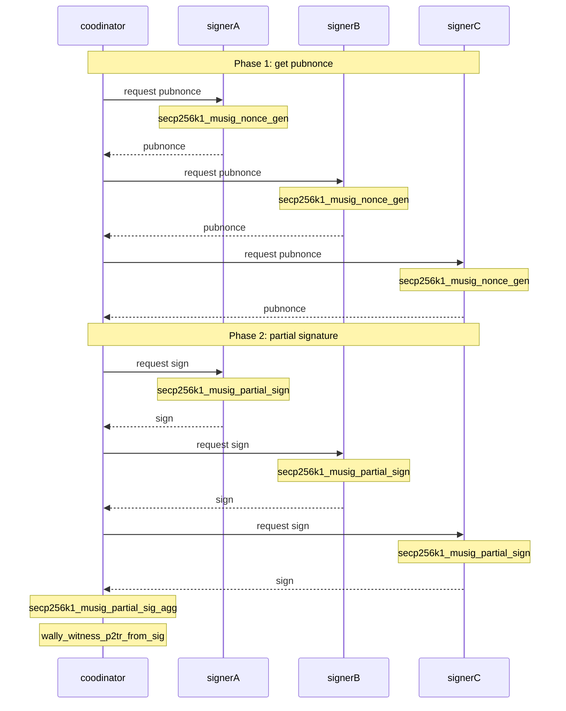

# MuSig2

* [libsecp256k1 musig.c](https://github.com/bitcoin-core/secp256k1/blob/00774d0723af1974e2a113db4adc479bfc47e20f/examples/musig.c)

## prepare

Use system installed `libsecp256k1`(built with `--enable-module-recovery`).  
v1.3.1 uses no-musig supported `libsecp256k1`.

```console
$ git clone https://github.com/bitcoin-core/secp256k1.git
$ cd secp256k1
$ git checkout -b v0.6.0 refs/tags/v0.6.0
$ ./autogen.sh
$ ./configure --enable-module-recovery
$ make
$ sudo make install
$ cd ..
```

Use libwally-core v1.3.1.

```console
$ git clone https://github.com/ElementsProject/libwally-core.git
$ cd libwally-core
$ git checkout -b v1.3.1 release_1.3.1

.$ /tools/autogen.sh
$ ./configure --prefix $HOME/.local --enable-minimal --disable-elements --enable-standard-secp --with-system-secp256k1 --disable-shared
$ make
$ make install
```

## build

```bash
git clone https://github.com/hirokuma/c-musig2.git
cd c-musig2
make
```

## run

```console
$ ./tst
pub[0]: 034646ae5047316b4230d0086c8acec687f00b1cd9d1dc634f6cb358ac0a9a8fff
pub[1]: 02a062cdf1723705cd5eeb0fca9a7f68cd462eb27b503935d35e127a19a42355ef
pub[2]: 02430bd270f7c7c4454703c2cecd1d612e38437cec3a640a8745757b551d996710
agg_32: 1243b9429e070edfedf0f3bd6c76ff17cefb9cb8c1860fa006d254cddcc9bb92
witness program: 51201243b9429e070edfedf0f3bd6c76ff17cefb9cb8c1860fa006d254cddcc9bb92
address: bcrt1pzfpmjs57qu8dlm0s7w7kcahlzl80h89ccxrqlgqx6f2vmhxfhwfqfs97n2
sigHash: ae7f512dfd7f6e62cdc5cc3cea350d609cf77d432884e958cad0292aec64d6d4
sig64: 0836e5bb733cfb11036611558e30772b1699841ac94bc42351696dedab5b5b5bbcbe4683b5017aa698a84593281748d1f41ea1908d658123f970419813c5200e
hex: 02000000000101b51cb76009876c5f0fd9f7678b02a60045ff17dc8e717c0332b5852e5ec845000000000000ffffffff01f0b9f50500000000160014adb802233d8444a772bf6c36a3ff82ee69fba71601400836e5bb733cfb11036611558e30772b1699841ac94bc42351696dedab5b5b5bbcbe4683b5017aa698a84593281748d1f41ea1908d658123f970419813c5200e00000000
```

## sequence

### Get public keys



### Sign


